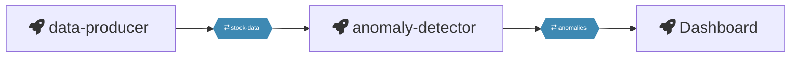

```mermaid
%%{ init: { 'flowchart': { 'curve': 'monotoneX' } } }%%
graph LR;
data-producer[fa:fa-rocket data-producer &#8205] --> stock-data{{ fa:fa-arrow-right-arrow-left stock-data &#8205}}:::topic;
stock-data{{ fa:fa-arrow-right-arrow-left stock-data &#8205}}:::topic --> anomaly-detector[fa:fa-rocket anomaly-detector &#8205];
anomaly-detector[fa:fa-rocket anomaly-detector &#8205] --> anomalies{{ fa:fa-arrow-right-arrow-left anomalies &#8205}}:::topic;
anomalies{{ fa:fa-arrow-right-arrow-left anomalies &#8205}}:::topic --> Dashboard[fa:fa-rocket Dashboard &#8205];


classDef default font-size:110%;
classDef topic font-size:80%;
classDef topic fill:#3E89B3;
classDef topic stroke:#3E89B3;
classDef topic color:white;
```